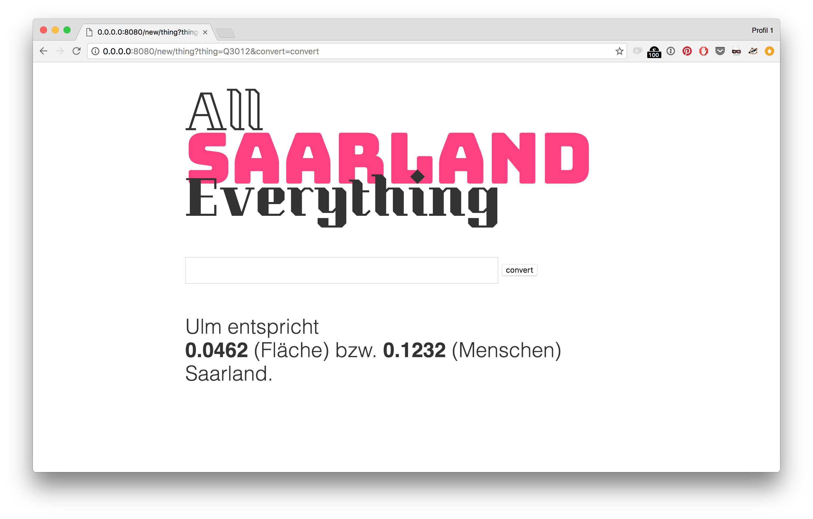

# All Saarland Everything
Built during the Open Knowledge Labs Wikidata Hackathon.

## Caveats / known bugs
- Proceed with caution, for this is hackathon-quality code (and I'm not a web developer).
- Currently only supports conversion of things that have a width x height property, an area, population or maximum capacity (in people)
- Ironically, units other than km^2 (for areas) or metres (for width x height) will yield incorrect results.

## Dependencies

- bottle.py
- urllib2
